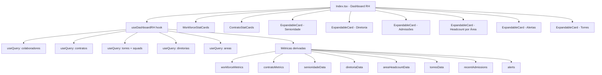

# Design Document — Dashboard de Gestão de RH

## Overview

Redesenho completo da página `src/pages/Index.tsx` para uma visão de gestão de RH orientada a dados acionáveis. O novo dashboard substitui os componentes genéricos atuais (`StatCards`, `Charts`) por um conjunto de painéis temáticos que cobrem força de trabalho, saúde organizacional, contratos e alertas operacionais.

A abordagem central é o padrão **ExpandableCard**: cards que exibem uma prévia truncada por padrão e revelam o conteúdo completo ao clicar em "Ver mais". Isso mantém a densidade de informação sem sobrecarregar visualmente a página.

Toda a lógica de dados é centralizada em um hook customizado (`useDashboardRH`) que agrega múltiplas queries React Query em paralelo, expondo métricas derivadas já calculadas para os componentes de apresentação.

---

## Architecture



**Decisões de design:**

- Queries paralelas via React Query — cada entidade tem seu próprio `queryKey`, aproveitando cache existente de outras páginas.
- Toda derivação de métricas ocorre no hook, não nos componentes — componentes são puramente apresentacionais.
- `ExpandableCard` é um componente genérico reutilizável que recebe `preview` e `full` como render props.
- Os componentes `StatCards.tsx` e `Charts.tsx` existentes são substituídos por novos componentes específicos do dashboard RH.

---

## Components and Interfaces

### `useDashboardRH` (hook)

```typescript
interface DashboardRHData {
  isLoading: boolean;
  workforceMetrics: WorkforceMetrics;
  contratoMetrics: ContratoMetrics;
  senioridadeData: SenioridadeItem[];
  diretoriaData: DiretoriaItem[];
  areaHeadcountData: AreaHeadcountItem[];
  torresData: TorreItem[];
  recentAdmissions: RecentAdmission[];
  alerts: Alert[];
}
```

### `ExpandableCard`

```typescript
interface ExpandableCardProps {
  title: string;
  preview: React.ReactNode;   // conteúdo colapsado
  full: React.ReactNode;      // conteúdo expandido
  defaultExpanded?: boolean;
}
```

Estado interno: `expanded: boolean` controlado por `useState`. Botão "Ver mais" / "Ver menos" no rodapé do card.

### `WorkforceStatCards`

Recebe `WorkforceMetrics` e renderiza 6 StatCards em grid responsivo.

### `ContratoStatCards`

Recebe `ContratoMetrics` e renderiza 4 StatCards.

### `SenioridadeBarChart`

Wrapper de `BarChart` (Recharts, layout vertical) que recebe `SenioridadeItem[]` e um flag `collapsed` para limitar a 4 itens.

### `DiretoriaPieChart`

Wrapper de `PieChart` (Recharts, donut) que recebe `DiretoriaItem[]` e `collapsed` para controlar altura.

### `AreaBarChart`

Wrapper de `BarChart` (Recharts, layout vertical) que recebe `AreaHeadcountItem[]` e `collapsed` para limitar a 5 ou 10 itens.

### `AlertsPanel`

Lista de alertas com badge de tipo e nome do item afetado. Colapsado: máximo 3 alertas + indicador "...".

### `TorresList`

Lista de torres com nome, contagem de squads e total de membros. Colapsado: 4 torres.

### `RecentAdmissionsList`

Lista de colaboradores com nome, senioridade e data formatada. Colapsado: 5 itens, expandido: 10.

---

## Data Models

### Métricas derivadas (calculadas no hook)

```typescript
interface WorkforceMetrics {
  totalColaboradores: number;
  totalAtivos: number;
  totalDesligados: number;
  taxaOcupacao: number;          // % ativos com squad_ids.length > 0
  totalDiretoriasAtivas: number; // diretorias com ao menos 1 colaborador ativo
  totalAreasAtivas: number;      // areas com ao menos 1 colaborador ativo
}

interface ContratoMetrics {
  totalAtivos: number;
  totalPausados: number;
  totalTorresAtivas: number;     // torres vinculadas a contratos ativos
  totalSquadsAtivos: number;     // squads vinculados a contratos ativos
}

interface SenioridadeItem {
  name: string;   // nível de senioridade
  value: number;  // headcount de ativos
}

interface DiretoriaItem {
  name: string;   // nome da diretoria ou "Sem Diretoria"
  value: number;  // headcount de ativos
}

interface AreaHeadcountItem {
  name: string;   // nome da área
  value: number;  // headcount de ativos
}

interface TorreItem {
  id: string;
  nome: string;
  squadsCount: number;
  totalMembros: number;
}

interface RecentAdmission {
  id: string;
  nomeCompleto: string;
  senioridade: string;
  dataAdmissao: string;          // formatada DD/MM/AAAA
}

interface Alert {
  type: 'Squad sem líder' | 'Squad vazio' | 'Colaborador sem diretoria';
  itemName: string;
  itemId: string;
}
```

### Cálculo de `taxaOcupacao`

```
taxaOcupacao = (ativos com squad_ids.length > 0) / totalAtivos * 100
```

### Cálculo de `totalTorresAtivas`

Contratos com `status === 'Ativo'` → coletar todos os `torres[]` → deduplica por Set → tamanho.

### Cálculo de `totalSquadsAtivos`

Todos os squads onde `contrato_id` pertence a um contrato com `status === 'Ativo'`.

### Cálculo de `totalMembros` por Torre

```
torre.squads.reduce((sum, s) => sum + (s.membros?.length ?? 0), 0)
```

---

## Correctness Properties

*A property is a characteristic or behavior that should hold true across all valid executions of a system — essentially, a formal statement about what the system should do. Properties serve as the bridge between human-readable specifications and machine-verifiable correctness guarantees.*

### Property 1: Taxa de Ocupação é consistente com os dados de colaboradores

*Para qualquer* lista de colaboradores ativos, a `taxaOcupacao` calculada deve ser igual ao número de ativos com `squad_ids.length > 0` dividido pelo total de ativos, multiplicado por 100. Se não houver ativos, o resultado deve ser 0.

**Validates: Requirements 1.4**

---

### Property 2: Contagem de diretorias ativas é subconjunto das diretorias existentes

*Para qualquer* conjunto de colaboradores e diretorias, o `totalDiretoriasAtivas` deve ser menor ou igual ao número total de diretorias cadastradas, e deve conter apenas IDs que existem na lista de diretorias.

**Validates: Requirements 1.5**

---

### Property 3: Distribuição por senioridade cobre todos os ativos

*Para qualquer* lista de colaboradores ativos, a soma dos `value` em `senioridadeData` deve ser igual ao `totalAtivos`.

**Validates: Requirements 2.1, 2.4**

---

### Property 4: Distribuição por diretoria cobre todos os ativos (incluindo sem diretoria)

*Para qualquer* lista de colaboradores ativos, a soma dos `value` em `diretoriaData` deve ser igual ao `totalAtivos`. Colaboradores sem `diretoria_id` devem aparecer na categoria "Sem Diretoria".

**Validates: Requirements 3.1, 3.4**

---

### Property 5: Admissões recentes estão ordenadas por data decrescente

*Para qualquer* lista de colaboradores, os itens em `recentAdmissions` devem estar ordenados de forma que `recentAdmissions[i].dataAdmissao >= recentAdmissions[i+1].dataAdmissao` para todo `i` válido.

**Validates: Requirements 5.1, 5.2, 5.3**

---

### Property 6: Torres ordenadas por squadsCount decrescente

*Para qualquer* lista de torres, os itens em `torresData` devem estar ordenados de forma que `torresData[i].squadsCount >= torresData[i+1].squadsCount` para todo `i` válido.

**Validates: Requirements 8.1**

---

### Property 7: Total de membros por torre é a soma dos membros dos squads

*Para qualquer* torre com squads, `totalMembros` deve ser igual à soma de `(squad.membros?.length ?? 0)` para todos os squads da torre.

**Validates: Requirements 8.4**

---

### Property 8: Alertas de squads sem líder são corretos

*Para qualquer* lista de squads, todos os squads com `lider === null` devem aparecer nos alertas com tipo "Squad sem líder", e nenhum squad com líder definido deve aparecer nessa categoria.

**Validates: Requirements 7.1, 7.7**

---

### Property 9: Formatação de data de admissão

*Para qualquer* string de data no formato ISO (YYYY-MM-DD), a função de formatação deve produzir uma string no formato DD/MM/AAAA.

**Validates: Requirements 5.5**

---

## Error Handling

| Cenário | Comportamento |
|---|---|
| Query falha (rede/Supabase) | React Query retorna `[]` via `onError` — componentes renderizam com dados vazios, sem crash |
| Colaborador sem `diretoria_id` | Agrupado em "Sem Diretoria" no gráfico de distribuição |
| Torre sem squads | Exibida com `squadsCount: 0` e `totalMembros: 0` |
| Squad com `membros: null` | Tratado como array vazio (`membros?.length ?? 0`) |
| Nenhum alerta ativo | Painel exibe mensagem "Tudo certo por aqui" |
| `totalAtivos === 0` | `taxaOcupacao` retorna `0` (evita divisão por zero) |

---

## Testing Strategy

### Abordagem dual

- **Testes unitários**: exemplos concretos, casos de borda e condições de erro na lógica de derivação de métricas.
- **Testes de propriedade**: validação universal das propriedades listadas acima, usando [fast-check](https://github.com/dubzzz/fast-check) (biblioteca PBT para TypeScript/JavaScript).

### Testes unitários

Focados em:
- Formatação de data (`DD/MM/AAAA`) com datas válidas e edge cases (ano bissexto, mês com zero à esquerda)
- Cálculo de `taxaOcupacao` com `totalAtivos === 0`
- Agrupamento de colaboradores sem `diretoria_id` em "Sem Diretoria"
- Geração de alertas para squads sem líder, squads vazios e colaboradores sem diretoria

### Testes de propriedade (fast-check)

Cada propriedade do design deve ser implementada como um único teste de propriedade com mínimo de **100 iterações**.

Tag format: `Feature: dashboard-gestao-rh, Property {N}: {texto}`

| Teste | Propriedade | Tag |
|---|---|---|
| `taxaOcupacao` é consistente | Property 1 | `Feature: dashboard-gestao-rh, Property 1` |
| Diretorias ativas ⊆ diretorias existentes | Property 2 | `Feature: dashboard-gestao-rh, Property 2` |
| Soma senioridade = totalAtivos | Property 3 | `Feature: dashboard-gestao-rh, Property 3` |
| Soma diretoria = totalAtivos | Property 4 | `Feature: dashboard-gestao-rh, Property 4` |
| Admissões ordenadas por data | Property 5 | `Feature: dashboard-gestao-rh, Property 5` |
| Torres ordenadas por squadsCount | Property 6 | `Feature: dashboard-gestao-rh, Property 6` |
| totalMembros = soma membros squads | Property 7 | `Feature: dashboard-gestao-rh, Property 7` |
| Alertas sem líder são corretos | Property 8 | `Feature: dashboard-gestao-rh, Property 8` |
| Formatação de data ISO → DD/MM/AAAA | Property 9 | `Feature: dashboard-gestao-rh, Property 9` |

### Localização dos testes

```
src/test/dashboard-gestao-rh.test.ts
```

A lógica de derivação de métricas deve ser extraída para funções puras em `src/utils/dashboardRH.ts` para facilitar o teste sem dependência de React ou Supabase.
