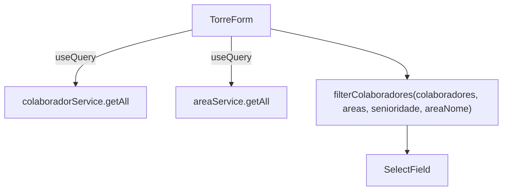

# Design Document — Filtro de Colaboradores por Senioridade e Área nos Campos de Head e Gerente da Página de Torres

## Overview

Esta feature adiciona filtros contextuais aos campos de seleção de Head e Gerente no `TorreForm`. Atualmente, todos os campos exibem a lista completa de colaboradores. Após a mudança, cada campo exibirá apenas os colaboradores elegíveis: senioridade correta **e** pertencentes à área correspondente.

A filtragem é feita inteiramente no cliente (client-side), aproveitando os dados já disponíveis via React Query. Não há mudanças no banco de dados nem em serviços de backend.

## Architecture



O `TorreForm` faz duas queries em paralelo (colaboradores e áreas). Uma função utilitária pura `filterColaboradores` recebe a lista completa, o nome da área alvo e a senioridade desejada, e retorna o subconjunto filtrado. Cada campo de seleção usa o resultado dessa função.

## Components and Interfaces

### Função utilitária `filterColaboradores`

```ts
function filterColaboradores(
  colaboradores: Colaborador[],
  areas: Area[],
  senioridade: Senioridade,
  areaNome: string   // case-insensitive
): Colaborador[]
```

- Localiza a área pelo nome (case-insensitive).
- Se a área não for encontrada (fallback), retorna todos os colaboradores com a senioridade correta.
- Retorna colaboradores cujo `senioridade === senioridade` **e** `area_ids.includes(area.id)`.

### Alterações no `TorreForm`

| Campo | Senioridade | Área |
|---|---|---|
| Head de Tecnologia | `"Head"` | `"tecnologia"` |
| Head de Produto | `"Head"` | `"produto"` |
| Gerente de Produto | `"Gerente"` | `"produto"` |
| Gerente de Design | `"Gerente"` | `"design"` |
| Responsável pelo Negócio | sem filtro | sem filtro (apenas `status === "Ativo"`) |

Adição de uma segunda `useQuery` para áreas:

```ts
const { data: areas = [], isLoading: areasLoading } = useQuery({
  queryKey: ["areas"],
  queryFn: () => areaService.getAll(),
});
```

Os campos ficam `disabled` enquanto `isLoading || areasLoading`.

## Data Models

Nenhuma alteração de schema. Os modelos existentes já suportam a feature:

```ts
// Colaborador (src/types/colaborador.ts)
interface Colaborador {
  id: string;
  nomeCompleto: string;
  senioridade: Senioridade;   // "Head" | "Gerente" | ...
  area_ids: string[];         // UUIDs das áreas
  status: Status;             // "Ativo" | "Desligado"
  // ...
}

// Area (src/types/area.ts)
interface Area {
  id: string;
  nome: string;               // "Tecnologia" | "Produto" | "Design" | ...
  // ...
}
```

A lógica de filtro é:

```
colaborador.senioridade === targetSenioridade
  && colaborador.area_ids.includes(area.id)
```

onde `area` é encontrada por `area.nome.toLowerCase() === areaNome.toLowerCase()`.


## Correctness Properties

*A property is a characteristic or behavior that should hold true across all valid executions of a system — essentially, a formal statement about what the system should do. Properties serve as the bridge between human-readable specifications and machine-verifiable correctness guarantees.*

### Property 1: Filtro retorna apenas colaboradores com senioridade e área corretas

*Para qualquer* lista de colaboradores (com senioridades e `area_ids` variados) e qualquer lista de áreas, ao chamar `filterColaboradores(colaboradores, areas, senioridade, areaNome)`, todos os elementos retornados devem ter `senioridade === senioridade` **e** `area_ids` contendo o `id` da área cujo `nome.toLowerCase() === areaNome.toLowerCase()`.

Cobre os edge-cases: lista vazia de colaboradores, nenhum colaborador satisfazendo o filtro (resultado vazio).

**Validates: Requirements 1.2, 2.1, 3.1, 4.1, 1.3, 2.2, 3.2, 4.2**

---

### Property 2: Colaborador com múltiplas áreas aparece em todos os filtros aplicáveis

*Para qualquer* colaborador cujo `area_ids` contenha os IDs de duas áreas distintas (ex: Tecnologia e Produto) e cuja `senioridade` seja "Head", esse colaborador deve aparecer no resultado de `filterColaboradores` para ambas as áreas.

**Validates: Requirements 2.3**

---

### Property 3: Matching de área é case-insensitive

*Para qualquer* string que seja variação de capitalização de um nome de área (ex: "TECNOLOGIA", "Tecnologia", "tecnologia", "tEcNoLoGiA"), `filterColaboradores` deve identificar a mesma área e retornar o mesmo conjunto de colaboradores.

**Validates: Requirements 6.1, 6.2, 6.3**

---

### Property 4: Fallback quando área não existe retorna todos com a senioridade correta

*Para qualquer* lista de colaboradores e uma lista de áreas que **não** contém a área alvo pelo nome, `filterColaboradores` deve retornar todos os colaboradores cuja `senioridade` corresponde ao parâmetro, sem filtro de área.

**Validates: Requirements 6.4**

---

### Property 5: Campo Responsável pelo Negócio exibe apenas colaboradores ativos

*Para qualquer* lista de colaboradores com status mistos ("Ativo" e "Desligado"), a lista exibida no campo "Responsável pelo Negócio" deve conter exatamente os colaboradores com `status === "Ativo"`.

**Validates: Requirements 5.1**

---

## Error Handling

| Situação | Comportamento |
|---|---|
| Query de colaboradores falha | `colaboradorService.getAll` já retorna `[]` em caso de erro (não lança exceção); campos ficam vazios mas funcionais |
| Query de áreas falha | `areaService.getAll` lança exceção; React Query exibirá estado de erro; campos ficam desabilitados |
| Área não encontrada pelo nome | Fallback: exibe todos os colaboradores com a senioridade correta (Requirement 6.4) |
| Colaborador selecionado não está mais na lista filtrada | Valor é mantido no campo (não há limpeza automática) — Requirement 1.4 |

## Testing Strategy

### Abordagem dual

- **Testes unitários**: exemplos específicos, casos de borda e comportamentos de UI
- **Testes de propriedade**: validação universal da função `filterColaboradores` com entradas geradas aleatoriamente

### Testes unitários

Focados em:
- Renderização do `TorreForm` com campos desabilitados durante loading (Requirement 7.2)
- Valor selecionado preservado quando colaborador não está na lista filtrada (Requirement 1.4)
- Carregamento inicial dispara queries de colaboradores e áreas (Requirement 1.1)

### Testes de propriedade

Biblioteca: **fast-check** (já disponível no ecossistema TypeScript/Vitest).

Configuração mínima: **100 iterações** por propriedade.

Cada teste deve referenciar a propriedade do design no formato:
`// Feature: filtro-head-gerente-torres, Property N: <texto da propriedade>`

| Propriedade | Teste |
|---|---|
| Property 1 | Gerar lista aleatória de colaboradores e áreas; verificar que todos os retornados têm senioridade e área corretas |
| Property 2 | Gerar colaborador com múltiplos `area_ids`; verificar que aparece em ambos os filtros |
| Property 3 | Gerar variações de capitalização do nome da área; verificar resultado idêntico |
| Property 4 | Gerar lista de áreas sem a área alvo; verificar que retorna todos com a senioridade correta |
| Property 5 | Gerar lista mista de colaboradores ativos/desligados; verificar que apenas ativos aparecem |

A função `filterColaboradores` deve ser extraída como função pura e testável independentemente do componente React.
