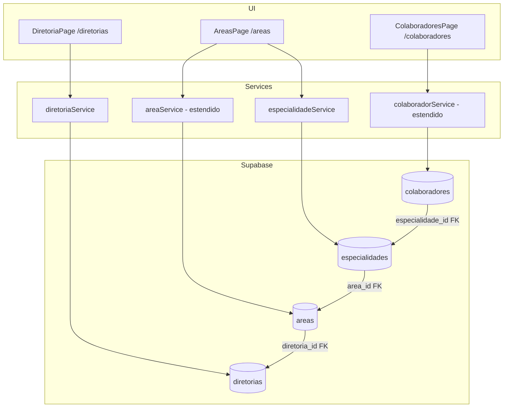

# Design Document — Hierarquia Organizacional

## Overview

Esta feature estende o sistema Alocatin adicionando dois novos níveis hierárquicos acima e abaixo da entidade `Area` já existente:

```
Diretoria (novo, nível superior)
  └── Area (existente, nível intermediário)
        └── Especialidade (novo, nível inferior)
              └── Colaborador (existente, vinculado)
```

O objetivo é substituir o campo livre `subarea` (texto) por uma entidade gerenciada `Especialidade`, e agrupar as Áreas dentro de Diretorias. As mudanças abrangem banco de dados (Supabase), tipos TypeScript, serviços, componentes e páginas.

---

## Architecture

O sistema segue uma arquitetura de SPA React com acesso direto ao Supabase via client-side SDK. Não há camada de API intermediária.



### Fluxo de dados hierárquico

- `DiretoriaPage` gerencia CRUD de Diretorias via `diretoriaService`
- `AreasPage` é estendida para exibir Diretoria associada, filtrar por Diretoria e listar Especialidades por Área
- `ColaboradoresPage` é estendida para carregar Especialidades dinamicamente conforme a Área selecionada no formulário

---

## Components and Interfaces

### Novos arquivos

| Arquivo | Responsabilidade |
|---|---|
| `src/types/diretoria.ts` | Tipos `Diretoria`, `DiretoriaInput` |
| `src/types/especialidade.ts` | Tipos `Especialidade`, `EspecialidadeInput` |
| `src/services/diretoriaService.ts` | CRUD de Diretorias no Supabase |
| `src/services/especialidadeService.ts` | CRUD de Especialidades no Supabase |
| `src/pages/Diretorias.tsx` | Página de listagem/gerenciamento de Diretorias |
| `src/components/diretorias/DiretoriaForm.tsx` | Formulário de criação/edição de Diretoria |
| `src/components/diretorias/DeleteConfirmDialog.tsx` | Dialog de confirmação de exclusão |
| `src/components/especialidades/EspecialidadeForm.tsx` | Formulário de criação/edição de Especialidade (usado dentro de AreasPage) |
| `src/components/especialidades/DeleteConfirmDialog.tsx` | Dialog de confirmação de exclusão de Especialidade |
| `supabase/migrations/YYYYMMDD_hierarquia_organizacional.sql` | Migration SQL |

### Arquivos modificados

| Arquivo | Mudança |
|---|---|
| `src/types/area.ts` | Adicionar campo `diretoria_id?: string \| null` |
| `src/types/colaborador.ts` | Adicionar campo `especialidade_id?: string \| null`, remover dependência de `subarea` como string livre |
| `src/services/areaService.ts` | Adicionar `getByDiretoria(id)`, join com `diretorias` no `getAll` |
| `src/services/colaboradorService.ts` | Mapear `especialidade_id` em `fromDb`/`toDb` |
| `src/components/areas/AreaForm.tsx` | Adicionar select de Diretoria (obrigatório) |
| `src/components/colaboradores/ColaboradorForm.tsx` | Substituir subarea livre por select de Especialidade carregado dinamicamente |
| `src/pages/Areas.tsx` | Exibir Diretoria e contagem de Especialidades; adicionar filtro por Diretoria |
| `src/pages/Colaboradores.tsx` | Exibir nome da Especialidade; adicionar filtro por Especialidade |
| `src/components/AppLayout.tsx` | Adicionar item "Diretorias" no menu lateral |
| `src/App.tsx` | Adicionar rota `/diretorias` |
| `src/integrations/supabase/types.ts` | Adicionar tipos gerados para `diretorias` e `especialidades` |

---

## Data Models

### Banco de dados — novas tabelas

```sql
-- Tabela Diretorias
CREATE TABLE public.diretorias (
  id          UUID PRIMARY KEY DEFAULT gen_random_uuid(),
  nome        TEXT NOT NULL,
  descricao   TEXT,
  created_at  TIMESTAMPTZ NOT NULL DEFAULT now(),
  updated_at  TIMESTAMPTZ NOT NULL DEFAULT now()
);

-- Tabela Especialidades
CREATE TABLE public.especialidades (
  id          UUID PRIMARY KEY DEFAULT gen_random_uuid(),
  nome        TEXT NOT NULL,
  area_id     UUID NOT NULL REFERENCES public.areas(id) ON DELETE CASCADE,
  descricao   TEXT,
  created_at  TIMESTAMPTZ NOT NULL DEFAULT now(),
  updated_at  TIMESTAMPTZ NOT NULL DEFAULT now()
);
```

### Banco de dados — alterações em tabelas existentes

```sql
-- Adicionar FK de Área → Diretoria (nullable para não quebrar dados existentes)
ALTER TABLE public.areas
  ADD COLUMN IF NOT EXISTS diretoria_id UUID REFERENCES public.diretorias(id) ON DELETE SET NULL;

-- Adicionar FK de Colaborador → Especialidade (nullable)
ALTER TABLE public.colaboradores
  ADD COLUMN IF NOT EXISTS especialidade_id UUID REFERENCES public.especialidades(id) ON DELETE SET NULL;

-- Índices de performance
CREATE INDEX IF NOT EXISTS idx_areas_diretoria_id       ON public.areas(diretoria_id);
CREATE INDEX IF NOT EXISTS idx_especialidades_area_id   ON public.especialidades(area_id);
CREATE INDEX IF NOT EXISTS idx_colaboradores_esp_id     ON public.colaboradores(especialidade_id);
```

### Tipos TypeScript

```typescript
// src/types/diretoria.ts
export interface Diretoria {
  id: string;
  nome: string;
  descricao?: string | null;
  created_at?: string;
  updated_at?: string;
}
export type DiretoriaInput = Pick<Diretoria, 'nome' | 'descricao'>;

// src/types/especialidade.ts
export interface Especialidade {
  id: string;
  nome: string;
  area_id: string;
  descricao?: string | null;
  created_at?: string;
  updated_at?: string;
}
export type EspecialidadeInput = Pick<Especialidade, 'nome' | 'area_id' | 'descricao'>;

// src/types/area.ts — campo adicionado
export interface Area {
  id: string;
  nome: string;
  diretoria_id?: string | null;   // novo
  subareas_possiveis: string[];
  lideres: string[];
  descricao: string;
  created_at?: string;
}

// src/types/colaborador.ts — campo adicionado
export interface Colaborador {
  // ... campos existentes ...
  especialidade_id?: string | null;  // novo — substitui subarea livre
  subarea: string | null;            // mantido por compatibilidade, deprecated
}
```

### Interfaces de serviço

```typescript
// diretoriaService
interface DiretoriaService {
  getAll(): Promise<Diretoria[]>;
  getById(id: string): Promise<Diretoria | null>;
  create(input: DiretoriaInput): Promise<Diretoria>;
  update(id: string, input: Partial<DiretoriaInput>): Promise<Diretoria>;
  remove(id: string): Promise<void>;  // lança erro se houver áreas vinculadas
}

// especialidadeService
interface EspecialidadeService {
  getAll(): Promise<Especialidade[]>;
  getByArea(areaId: string): Promise<Especialidade[]>;
  create(input: EspecialidadeInput): Promise<Especialidade>;
  update(id: string, input: Partial<EspecialidadeInput>): Promise<Especialidade>;
  remove(id: string): Promise<void>;  // lança erro se houver colaboradores vinculados
}
```

---

## Correctness Properties

*A property is a characteristic or behavior that should hold true across all valid executions of a system — essentially, a formal statement about what the system should do. Properties serve as the bridge between human-readable specifications and machine-verifiable correctness guarantees.*

### Property 1: Round-trip de criação de Diretoria

*Para qualquer* nome válido (não-vazio, não apenas espaços), após chamar `diretoriaService.create({ nome })`, uma chamada subsequente a `diretoriaService.getById(id)` deve retornar uma entidade com `nome` igual ao input original.

**Validates: Requirements 1.1, 1.2**

### Property 2: Nome vazio ou whitespace é rejeitado pelo schema

*Para qualquer* string composta inteiramente de espaços em branco (incluindo string vazia), o schema Zod dos formulários de Diretoria e Especialidade deve rejeitar o valor e impedir a submissão.

**Validates: Requirements 1.3, 3.3**

### Property 3: Exclusão de Diretoria com Áreas vinculadas é bloqueada

*Para qualquer* Diretoria que possua ao menos uma Área com `diretoria_id` apontando para ela, chamar `diretoriaService.remove(id)` deve lançar um erro e o registro deve permanecer na base.

**Validates: Requirements 1.5**

### Property 4: Lista de Diretorias é retornada em ordem alfabética

*Para qualquer* conjunto de Diretorias cadastradas com nomes aleatórios, `diretoriaService.getAll()` deve retornar a lista ordenada lexicograficamente por `nome` (A→Z).

**Validates: Requirements 1.7**

### Property 5: Filtro de busca por nome é case-insensitive

*Para qualquer* lista de Diretorias e qualquer string de busca Q, todos os resultados filtrados devem ter `nome` contendo Q (ignorando maiúsculas/minúsculas), e nenhum resultado cujo `nome` não contenha Q deve aparecer.

**Validates: Requirements 1.8**

### Property 6: Persistência de diretoria_id na Área

*Para qualquer* Área criada com um `diretoria_id` válido, buscar essa Área por id deve retornar o mesmo `diretoria_id` que foi enviado no input.

**Validates: Requirements 2.3**

### Property 7: Filtro de Áreas por Diretoria retorna apenas Áreas da Diretoria selecionada

*Para qualquer* Diretoria D e qualquer lista de Áreas, aplicar o filtro por D deve retornar exclusivamente Áreas com `diretoria_id === D.id` — nenhuma Área de outra Diretoria deve aparecer.

**Validates: Requirements 2.6**

### Property 8: Round-trip de criação de Especialidade

*Para qualquer* nome válido e `area_id` válido, após chamar `especialidadeService.create({ nome, area_id })`, uma chamada a `especialidadeService.getByArea(area_id)` deve incluir a Especialidade criada com os dados corretos.

**Validates: Requirements 3.1, 3.2**

### Property 9: Exclusão de Especialidade com Colaboradores vinculados é bloqueada

*Para qualquer* Especialidade que possua ao menos um Colaborador com `especialidade_id` apontando para ela, chamar `especialidadeService.remove(id)` deve lançar um erro e o registro deve permanecer na base.

**Validates: Requirements 3.4**

### Property 10: getByArea retorna apenas Especialidades da Área solicitada

*Para qualquer* `area_id`, `especialidadeService.getByArea(area_id)` deve retornar apenas Especialidades cujo `area_id` seja igual ao parâmetro — nenhuma Especialidade de outra Área deve aparecer.

**Validates: Requirements 3.7, 4.2**

### Property 11: Troca de Área no formulário de Colaborador limpa a Especialidade selecionada

*Para qualquer* estado de formulário onde uma Área A está selecionada com uma Especialidade E (pertencente a A), ao alterar o campo área para qualquer Área B ≠ A, o campo `especialidade_id` deve ser resetado para `null`.

**Validates: Requirements 4.3**

### Property 12: Persistência de especialidade_id no Colaborador

*Para qualquer* Colaborador criado com um `especialidade_id` válido, buscar esse Colaborador por id deve retornar o mesmo `especialidade_id` que foi enviado no input.

**Validates: Requirements 4.4**

### Property 13: Filtro de Colaboradores por Área retorna apenas Colaboradores da Área selecionada

*Para qualquer* Área A e qualquer lista de Colaboradores, aplicar o filtro por A deve retornar exclusivamente Colaboradores com `area === A.nome` — nenhum Colaborador de outra Área deve aparecer.

**Validates: Requirements 4.6**

### Property 14: Contagem de filhos por entidade pai é consistente

*Para qualquer* conjunto de Áreas e Especialidades, a contagem de Especialidades exibida para cada Área deve ser igual ao número de registros em `especialidades` com `area_id` correspondente; analogamente, a contagem de Áreas por Diretoria deve corresponder ao número de registros em `areas` com `diretoria_id` correspondente.

**Validates: Requirements 6.4, 6.5**

---

## Error Handling

### Erros de validação (client-side)

Todos os formulários usam `react-hook-form` + `zod`. Erros são exibidos inline abaixo do campo via `<FormMessage />`.

| Cenário | Mensagem |
|---|---|
| Nome de Diretoria vazio | "O nome deve ter ao menos 3 caracteres" |
| Diretoria não selecionada no form de Área | "Selecione uma Diretoria" |
| Nome de Especialidade vazio | "O nome deve ter ao menos 3 caracteres" |
| Área não selecionada no form de Especialidade | "Selecione uma Área" |

### Erros de integridade referencial (server-side)

Os serviços verificam dependências antes de deletar:

```typescript
// diretoriaService.remove
const { count } = await supabase
  .from('areas')
  .select('id', { count: 'exact', head: true })
  .eq('diretoria_id', id);
if (count && count > 0)
  throw new Error('Esta Diretoria possui Áreas associadas e não pode ser excluída.');

// especialidadeService.remove
const { count } = await supabase
  .from('colaboradores')
  .select('id', { count: 'exact', head: true })
  .eq('especialidade_id', id);
if (count && count > 0)
  throw new Error('Esta Especialidade possui Colaboradores associados e não pode ser excluída.');
```

Erros de rede/Supabase são capturados nas mutations do React Query e exibidos via `toast` com `variant: "destructive"`.

### Compatibilidade com dados existentes

- `diretoria_id` em `areas` é nullable — Áreas existentes continuam válidas sem Diretoria associada.
- `especialidade_id` em `colaboradores` é nullable — Colaboradores existentes continuam válidos.
- O campo `subarea` (texto livre) é mantido na tabela e no tipo por compatibilidade, mas marcado como deprecated na UI.

---

## Testing Strategy

### Abordagem dual

A estratégia combina testes unitários (exemplos concretos e casos de borda) com testes baseados em propriedades (cobertura ampla via geração de inputs aleatórios).

**Biblioteca de property-based testing:** `fast-check` (já compatível com Vitest/Jest, amplamente adotada no ecossistema TypeScript).

```bash
npm install --save-dev fast-check
```

### Testes unitários

Focados em exemplos específicos, integrações e casos de borda:

- `diretoriaService`: criação com nome válido, rejeição de nome vazio, bloqueio de exclusão com áreas vinculadas, exclusão bem-sucedida sem áreas
- `especialidadeService`: criação com area_id válido, bloqueio de exclusão com colaboradores vinculados
- `ColaboradorForm`: reset de especialidade ao trocar área, exibição condicional do select de especialidade
- `AreaForm`: exibição do select de Diretoria, validação de campo obrigatório
- Filtros em `AreasPage` e `ColaboradoresPage`: comportamento com lista vazia, com um item, com múltiplos itens

### Testes de propriedade

Cada propriedade do design deve ser implementada como um único teste `fast-check`. Configuração mínima: 100 execuções por propriedade.

**Tag format:** `// Feature: hierarquia-organizacional, Property N: <texto>`

| Propriedade | Teste |
|---|---|
| Property 1 | Round-trip: `create` → `getById` retorna dados equivalentes (Diretoria) |
| Property 2 | Para qualquer string de espaços/vazia, schema Zod rejeita (Diretoria e Especialidade) |
| Property 3 | Para qualquer Diretoria com N≥1 áreas, `remove` lança erro |
| Property 4 | Para qualquer conjunto de Diretorias, `getAll()` retorna lista ordenada alfabeticamente |
| Property 5 | Para qualquer lista e query Q, filtro retorna apenas itens cujo nome contém Q (case-insensitive) |
| Property 6 | Para qualquer Área com diretoria_id, `create`/`getById` preserva o diretoria_id |
| Property 7 | Para qualquer Diretoria D, filtrar por D retorna apenas áreas com `diretoria_id === D.id` |
| Property 8 | Round-trip: `create` → `getByArea` inclui a Especialidade criada (Especialidade) |
| Property 9 | Para qualquer Especialidade com N≥1 colaboradores, `remove` lança erro |
| Property 10 | Para qualquer area_id, `getByArea(id)` retorna apenas especialidades com `area_id === id` |
| Property 11 | Para qualquer troca de Área no form de Colaborador, especialidade_id é resetado para null |
| Property 12 | Para qualquer Colaborador com especialidade_id, `create`/`getById` preserva o especialidade_id |
| Property 13 | Para qualquer Área A, filtrar por A retorna apenas colaboradores com `area === A.nome` |
| Property 14 | Contagem de filhos por pai é consistente com registros reais (Especialidades/Área, Áreas/Diretoria) |

Exemplo de estrutura de teste:

```typescript
// Feature: hierarquia-organizacional, Property 4: Especialidades carregadas são da Área selecionada
it('getByArea retorna apenas especialidades da área solicitada', async () => {
  await fc.assert(
    fc.asyncProperty(fc.uuid(), async (areaId) => {
      const result = await especialidadeService.getByArea(areaId);
      return result.every(e => e.area_id === areaId);
    }),
    { numRuns: 100 }
  );
});
```
