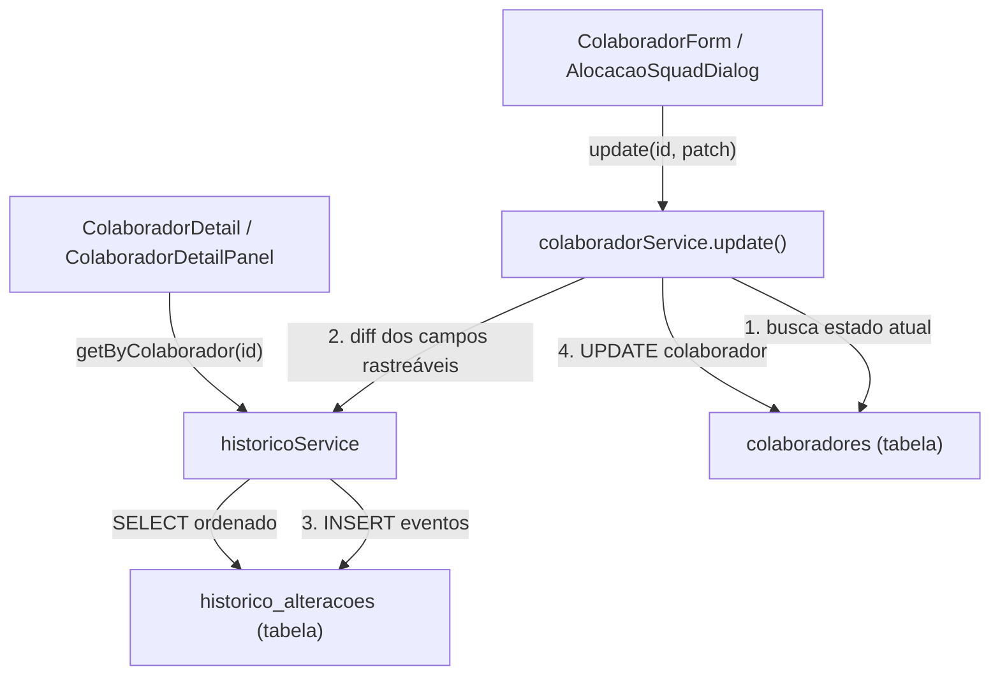

# Design Técnico: Histórico de Alterações do Colaborador

## Overview

Esta feature adiciona rastreamento automático de alterações nos campos críticos de colaboradores (`senioridade`, `diretoria_id`, `status`, `bu_id`, `torre_ids`, `squad_ids`). Cada mudança gera um `EventoAlteracao` persistido no PostgreSQL via Supabase. O histórico é exibido na página de detalhes do colaborador (`ColaboradorDetailPanel` e `ColaboradorDetail`).

A interceptação ocorre no `colaboradorService.update()`, que já é o ponto central de todas as mutações de colaborador na aplicação. Não há retroativo — apenas alterações a partir da implantação são registradas.

---

## Architecture



O fluxo de escrita é sequencial dentro do `update()`:
1. Busca o estado atual do colaborador antes do update.
2. Calcula o diff entre o estado atual e o patch recebido.
3. Insere os `EventoAlteracao` no histórico.
4. Executa o `UPDATE` no colaborador.

Se qualquer etapa falhar, um erro é lançado e a operação é abortada.

---

## Components and Interfaces

### `historicoService` (`src/services/historicoService.ts`)

```typescript
export interface EventoAlteracao {
  id: string;
  colaborador_id: string;
  campo: string;
  valor_anterior: string | null;
  novo_valor: string | null;
  alterado_em: string; // ISO 8601 UTC
  autor_alteracao: string | null;
}

export const historicoService = {
  async registrar(eventos: Omit<EventoAlteracao, "id" | "alterado_em">[]): Promise<void>,
  async getByColaborador(colaboradorId: string): Promise<EventoAlteracao[]>,
};
```

### `colaboradorService.update()` — modificação

O método atual será estendido para:
1. Chamar `getById(id)` antes do update para capturar o estado anterior.
2. Chamar `diffCamposRastreaveis(anterior, patch)` para calcular os eventos.
3. Chamar `historicoService.registrar(eventos)` se houver eventos.
4. Executar o `UPDATE` no Supabase.

### `diffCamposRastreaveis` (`src/services/historicoService.ts`)

Função pura que compara o estado anterior com o patch e retorna os eventos a registrar:

```typescript
export function diffCamposRastreaveis(
  anterior: Colaborador,
  patch: Partial<ColaboradorInput>
): Omit<EventoAlteracao, "id" | "alterado_em">[]
```

Campos rastreáveis: `senioridade`, `diretoria_id`, `status`, `bu_id`, `torre_ids`, `squad_ids`.

Para campos array (`torre_ids`, `squad_ids`), a serialização usa `JSON.stringify`.

### `HistoricoAlteracoes` (`src/components/colaboradores/HistoricoAlteracoes.tsx`)

Componente React que exibe a seção de histórico dentro do `ColaboradorDetailPanel` e `ColaboradorDetail`:

```typescript
interface Props {
  colaboradorId: string;
  torres: Torre[];
  squads: Squad[];
  diretorias: Diretoria[];
  businessUnits: BusinessUnit[];
}
```

Usa `useQuery` para buscar os eventos via `historicoService.getByColaborador`.

### `resolverValorCampo` (utilitário interno)

Função que converte o valor armazenado (string/JSON) para um texto legível, resolvendo IDs para nomes quando necessário.

---

## Data Models

### Tabela `historico_alteracoes` (nova migration)

```sql
CREATE TABLE historico_alteracoes (
  id              uuid PRIMARY KEY DEFAULT gen_random_uuid(),
  colaborador_id  uuid NOT NULL REFERENCES colaboradores(id) ON DELETE CASCADE,
  campo           text NOT NULL,
  valor_anterior  text,
  novo_valor      text,
  alterado_em     timestamptz NOT NULL DEFAULT now(),
  autor_alteracao text
);

CREATE INDEX idx_historico_colaborador_id ON historico_alteracoes(colaborador_id);
CREATE INDEX idx_historico_alterado_em    ON historico_alteracoes(alterado_em);
```

### Tipo TypeScript `EventoAlteracao`

```typescript
export interface EventoAlteracao {
  id: string;
  colaborador_id: string;
  campo: CampoRastreavel;        // "senioridade" | "diretoria_id" | "status" | "bu_id" | "torre_ids" | "squad_ids"
  valor_anterior: string | null;
  novo_valor: string | null;
  alterado_em: string;           // ISO 8601 UTC, gerado pelo banco
  autor_alteracao: string | null;
}

export type CampoRastreavel =
  | "senioridade"
  | "diretoria_id"
  | "status"
  | "bu_id"
  | "torre_ids"
  | "squad_ids";

export const CAMPOS_RASTREAVEIS: CampoRastreavel[] = [
  "senioridade", "diretoria_id", "status", "bu_id", "torre_ids", "squad_ids",
];

export const ROTULOS_CAMPOS: Record<CampoRastreavel, string> = {
  senioridade:  "Senioridade",
  diretoria_id: "Diretoria",
  status:       "Status",
  bu_id:        "Business Unit",
  torre_ids:    "Torres",
  squad_ids:    "Squads",
};
```

### Serialização de arrays

Campos `torre_ids` e `squad_ids` são armazenados como JSON string:
- `["id1", "id2"]` → `'["id1","id2"]'`
- Array vazio `[]` → `'[]'`
- `null` → `null`

---

## Correctness Properties

*A property is a characteristic or behavior that should hold true across all valid executions of a system — essentially, a formal statement about what the system should do. Properties serve as the bridge between human-readable specifications and machine-verifiable correctness guarantees.*

### Property 1: Registro de alteração em campo rastreável

*For any* colaborador e qualquer subconjunto não-vazio de campos rastreáveis com valores diferentes dos atuais, após chamar `colaboradorService.update()`, a tabela `historico_alteracoes` deve conter exatamente um `EventoAlteracao` para cada campo alterado, com `colaborador_id` correto, `valor_anterior` igual ao valor antes do update, `novo_valor` igual ao valor do patch, e `autor_alteracao` igual a `"sistema"`.

**Validates: Requirements 1.1, 1.2, 1.3, 1.4, 1.5, 1.7**

---

### Property 2: Omissão de registro quando valor não muda

*For any* colaborador e qualquer patch onde todos os campos rastreáveis presentes têm o mesmo valor que o estado atual, após chamar `colaboradorService.update()`, nenhum novo `EventoAlteracao` deve ser inserido na tabela `historico_alteracoes`.

**Validates: Requirements 1.6**

---

### Property 3: Consulta retorna eventos ordenados com todos os campos

*For any* colaborador com N eventos registrados, `historicoService.getByColaborador(colaboradorId)` deve retornar exatamente N eventos, cada um contendo os campos `id`, `campo`, `valor_anterior`, `novo_valor`, `alterado_em` e `autor_alteracao`, ordenados por `alterado_em` decrescente (mais recente primeiro).

**Validates: Requirements 3.1, 3.2**

---

### Property 4: Formatação de evento exibe todos os metadados

*For any* `EventoAlteracao`, a renderização do componente `HistoricoAlteracoes` deve exibir: o rótulo legível do campo (ex: "Senioridade"), o valor anterior, o novo valor e a data/hora formatada em pt-BR (ex: "14/03/2026 às 15:30").

**Validates: Requirements 4.2**

---

### Property 5: Mapeamento de campo para rótulo legível

*For any* valor de `CampoRastreavel`, a função `ROTULOS_CAMPOS[campo]` deve retornar uma string não-vazia diferente do nome técnico do campo.

**Validates: Requirements 4.6**

---

### Property 6: Resolução de IDs para nomes

*For any* `EventoAlteracao` cujo campo seja `torre_ids`, `squad_ids`, `diretoria_id` ou `bu_id`, a função `resolverValorCampo` deve retornar uma string com os nomes correspondentes (separados por vírgula para arrays), nunca retornando os IDs brutos quando os dados de referência estiverem disponíveis.

**Validates: Requirements 4.7, 4.8**

---

### Property 7: Serialização JSON de arrays é round-trip

*For any* array de strings (incluindo array vazio), `JSON.parse(JSON.stringify(arr))` deve produzir um array equivalente ao original — garantindo que a serialização usada para armazenar `torre_ids` e `squad_ids` é reversível sem perda de dados.

**Validates: Requirements 5.3**

---

### Property 8: Consistência update + histórico

*For any* update bem-sucedido de um campo rastreável, o estado atual do colaborador após o update deve ser consistente com o `novo_valor` do último `EventoAlteracao` registrado para aquele campo.

**Validates: Requirements 5.1**

---

## Error Handling

- Se `historicoService.registrar()` falhar (ex: violação de FK, timeout), o erro é propagado e o `UPDATE` do colaborador não é executado, mantendo consistência.
- Se `historicoService.getByColaborador()` falhar, o componente `HistoricoAlteracoes` exibe "Não foi possível carregar o histórico." sem bloquear as demais seções do painel.
- Se `getById()` (busca do estado anterior) falhar antes do update, o erro é propagado e nenhuma operação é realizada.
- Campos rastreáveis ausentes no patch (não enviados) são ignorados — apenas campos explicitamente presentes no patch são comparados.

---

## Testing Strategy

### Abordagem dual

Testes unitários cobrem exemplos específicos, casos de borda e condições de erro. Testes de propriedade cobrem o comportamento universal com entradas geradas aleatoriamente.

**Testes unitários** (`src/test/historico-alteracoes-colaborador.test.ts`):
- Exemplo: schema da tabela `historico_alteracoes` contém todos os campos esperados (Req 2.1)
- Exemplo: ON DELETE CASCADE remove histórico ao deletar colaborador (Req 2.2)
- Exemplo: estado vazio exibe "Nenhuma alteração registrada ainda." (Req 3.3)
- Exemplo: `getByColaborador` é uma função exportada pelo `historicoService` (Req 3.4)
- Exemplo: seção "Histórico de Alterações" é renderizada no painel (Req 4.1)
- Exemplo: autor diferente de "sistema" é exibido no evento (Req 4.3)
- Exemplo: erro na busca exibe mensagem de fallback (Req 4.5)
- Exemplo: `alterado_em` não é enviado pelo cliente (Req 5.4)
- Exemplo: falha no registro do histórico impede o update do colaborador (Req 5.2)

**Testes de propriedade** (`src/test/historico-alteracoes-colaborador.test.ts`):
- Biblioteca: [fast-check](https://fast-check.dev/) (já compatível com Vitest/TypeScript)
- Mínimo de 100 iterações por propriedade
- Cada teste referencia a propriedade do design com o tag:
  `// Feature: historico-alteracoes-colaborador, Property N: <texto>`

Mapeamento propriedade → teste:
| Propriedade | Tipo | Descrição resumida |
|---|---|---|
| P1 | property | Registro correto para qualquer campo rastreável alterado |
| P2 | property | Nenhum registro quando valor não muda |
| P3 | property | Consulta retorna N eventos ordenados com todos os campos |
| P4 | property | Renderização exibe todos os metadados do evento |
| P5 | property | ROTULOS_CAMPOS retorna rótulo não-vazio para todo CampoRastreavel |
| P6 | property | resolverValorCampo retorna nomes, não IDs brutos |
| P7 | property | Serialização JSON de arrays é round-trip |
| P8 | property | Estado do colaborador consistente com novo_valor do último evento |
