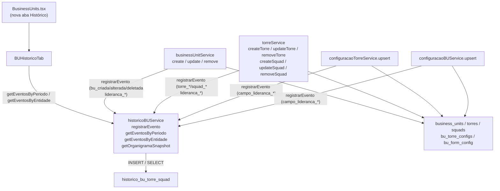

# Design Técnico: Histórico de BUs, Torres e Squads

## Overview

Esta feature implementa rastreamento completo de eventos em Business Units, Torres e Squads. Cada operação de criação, alteração ou deleção — incluindo mudanças em campos de liderança e atribuição de pessoas a cargos — gera um `EventoBUTorreSquad` persistido na tabela `historico_bu_torre_squad` com snapshot dos dados, permitindo reconstrução do organograma em qualquer data passada (time-travel).

A interceptação ocorre nos serviços existentes (`businessUnitService`, `torreService`, `configuracaoTorreService`, `configuracaoBUService`), que passam a chamar o novo `historicoBUService.registrarEvento()` antes ou após cada operação. O histórico é exibido na página `BusinessUnits` em uma nova aba "Histórico" (`BUHistoricoTab`).

Não há retroativo: apenas eventos ocorridos a partir da implantação são registrados.

---

## Architecture



### Fluxo de escrita (create)

1. Serviço executa INSERT na tabela da entidade.
2. Serviço chama `historicoBUService.registrarEvento()` com snapshot dos dados retornados.
3. Se o registro do evento falhar, o erro é propagado (a entidade já foi criada — ver seção Error Handling).

### Fluxo de escrita (update)

1. Serviço busca o estado atual da entidade (`getById`).
2. Executa UPDATE na tabela da entidade.
3. Chama `registrarEvento` com snapshot contendo `antes` e `depois`.
4. Para campos `liderancas`, chama `diffLiderancas()` e registra um evento por cargo modificado.

### Fluxo de escrita (delete)

1. Serviço busca o estado atual da entidade (`getById`) — snapshot completo.
2. Chama `registrarEvento` com o snapshot capturado.
3. Executa DELETE na tabela da entidade.
4. Se o registro do evento falhar antes do DELETE, o erro é propagado e o DELETE não ocorre.

---

## Components and Interfaces

### `historicoBUService` (`src/services/historicoBUService.ts`)

```typescript
export const historicoBUService = {
  async registrarEvento(
    evento: Omit<EventoBUTorreSquad, "id" | "ocorrido_em">
  ): Promise<void>,

  async getEventosByPeriodo(
    dataInicio: Date,
    dataFim: Date
  ): Promise<EventoBUTorreSquad[]>,

  async getEventosByEntidade(
    entidadeId: string
  ): Promise<EventoBUTorreSquad[]>,

  async getOrganigramaSnapshot(
    dataReferencia: Date
  ): Promise<OrganigramaSnapshot>,
};
```

### `diffLiderancas` (utilitário interno em `historicoBUService.ts`)

Função pura que compara dois mapas de lideranças e retorna os eventos a registrar:

```typescript
type LiderancaMap = Record<string, string | null>; // cargo_id → colaborador_id | null

export function diffLiderancas(
  entidadeId: string,
  entidadeTipo: EntidadeTipo,
  anterior: LiderancaMap,
  novo: LiderancaMap
): Omit<EventoBUTorreSquad, "id" | "ocorrido_em">[]
```

Regras:
- Cargo ausente no anterior e presente no novo com valor não-nulo → `lideranca_atribuida`
- Cargo presente em ambos com valores diferentes e não-nulos → `lideranca_alterada`
- Cargo presente no anterior com valor não-nulo e ausente/nulo no novo → `lideranca_removida`

### `diffCamposLideranca` (utilitário interno em `historicoBUService.ts`)

Compara duas listas de `CampoLiderancaConfig` e retorna eventos por campo modificado:

```typescript
export function diffCamposLideranca(
  entidadeId: string,
  entidadeTipo: EntidadeTipo,
  anterior: CampoLiderancaConfig[],
  novo: CampoLiderancaConfig[]
): Omit<EventoBUTorreSquad, "id" | "ocorrido_em">[]
```

Usa o campo `id` do `CampoLiderancaConfig` como chave de comparação.

### `BUHistoricoTab` (`src/components/business-units/BUHistoricoTab.tsx`)

```typescript
interface BUHistoricoTabProps {
  // sem props externas — busca dados internamente via useQuery
}
```

Estado interno:
- `filtroTipo: "todos" | "bu" | "torre" | "squad"` — filtro por entidade_tipo
- `dataInicio: Date | null` — início do intervalo de datas
- `dataFim: Date | null` — fim do intervalo de datas

Usa `useQuery` com `historicoBUService.getEventosByPeriodo` (padrão: últimos 90 dias).

Renderiza eventos agrupados por dia (chave: `ocorrido_em.toDateString()`), ordem decrescente.

### Modificações nos serviços existentes

**`businessUnitService`**:
- `create`: após INSERT, chama `registrarEvento({ tipo_evento: "bu_criada", ... })`
- `update`: busca estado anterior, executa UPDATE, chama `registrarEvento("bu_alterada")` + `diffLiderancas` se `liderancas` mudou
- `remove`: busca estado atual, chama `registrarEvento("bu_deletada")`, executa DELETE

**`torreService`**:
- `createTorre`: após INSERT, registra `torre_criada` com `entidade_pai_id = bu_id`
- `updateTorre`: busca anterior, UPDATE, registra `torre_alterada` + `diffLiderancas`
- `removeTorre`: busca anterior, registra `torre_deletada`, DELETE
- `createSquad`: após INSERT, registra `squad_criado` com `entidade_pai_id = torre_id`
- `updateSquad`: busca anterior, UPDATE, registra `squad_alterado` + diff do campo `lider`
- `removeSquad`: busca anterior, registra `squad_deletado`, DELETE

**`configuracaoTorreService.upsert`**:
- Busca config anterior via `getByBuId`
- Após upsert, chama `diffCamposLideranca` e registra eventos por campo modificado

**`configuracaoBUService.upsert`**:
- Busca config anterior via `get`
- Após upsert, chama `diffCamposLideranca` e registra eventos por campo modificado

---

## Data Models

### Migration SQL

```sql
-- supabase/migrations/20260323000000_historico_bu_torre_squad.sql

CREATE TABLE historico_bu_torre_squad (
  id               uuid        PRIMARY KEY DEFAULT gen_random_uuid(),
  tipo_evento      text        NOT NULL,
  entidade_tipo    text        NOT NULL CHECK (entidade_tipo IN ('bu', 'torre', 'squad')),
  entidade_id      uuid        NOT NULL,
  entidade_pai_id  uuid,
  snapshot_dados   jsonb       NOT NULL,
  ocorrido_em      timestamptz NOT NULL DEFAULT now(),
  autor_alteracao  text
);

CREATE INDEX idx_hist_bu_entidade_id   ON historico_bu_torre_squad(entidade_id);
CREATE INDEX idx_hist_bu_ocorrido_em   ON historico_bu_torre_squad(ocorrido_em);
CREATE INDEX idx_hist_bu_entidade_tipo ON historico_bu_torre_squad(entidade_tipo);
CREATE INDEX idx_hist_bu_tipo_data     ON historico_bu_torre_squad(entidade_tipo, ocorrido_em);
```

### Interfaces TypeScript

```typescript
// src/types/historicoBU.ts

export type TipoEventoBU =
  | "bu_criada"       | "bu_alterada"       | "bu_deletada"
  | "torre_criada"    | "torre_alterada"    | "torre_deletada"
  | "squad_criado"    | "squad_alterado"    | "squad_deletado"
  | "campo_lideranca_criado" | "campo_lideranca_alterado" | "campo_lideranca_removido"
  | "lideranca_atribuida"    | "lideranca_alterada"       | "lideranca_removida";

export type EntidadeTipo = "bu" | "torre" | "squad";

export interface EventoBUTorreSquad {
  id: string;
  tipo_evento: TipoEventoBU;
  entidade_tipo: EntidadeTipo;
  entidade_id: string;
  entidade_pai_id: string | null;
  snapshot_dados: Record<string, unknown>;
  ocorrido_em: string;           // ISO 8601 UTC, gerado pelo banco
  autor_alteracao: string | null;
}

// Estrutura do snapshot para eventos de liderança
export interface SnapshotLideranca {
  cargo: string;
  colaborador_anterior_id?: string | null;
  colaborador_novo_id?: string | null;
}

// Estrutura do snapshot para eventos de campo de liderança
export interface SnapshotCampoLideranca {
  campo_id: string;
  nome: string;
  senioridade: string;
  diretoria_id: string;
  nome_anterior?: string;
  senioridade_anterior?: string;
}

// Resultado do time-travel
export interface OrganigramaSnapshot {
  data_referencia: string;
  bus: OrganigramaBU[];
}

export interface OrganigramaBU {
  id: string;
  nome: string;
  descricao: string | null;
  liderancas: Record<string, string | null>;
  torres: OrganigramaTorre[];
}

export interface OrganigramaTorre {
  id: string;
  nome: string;
  bu_id: string;
  liderancas: Record<string, string | null>;
  squads: OrganigramaSquad[];
}

export interface OrganigramaSquad {
  id: string;
  nome: string;
  torre_id: string;
  lider: string | null;
  membros: string[];
  contrato_id: string | null;
}
```

### Estrutura do `snapshot_dados` por tipo de evento

| tipo_evento | campos do snapshot |
|---|---|
| `bu_criada` | `{ nome, descricao, liderancas }` |
| `bu_alterada` | `{ antes: { nome, descricao }, depois: { nome, descricao } }` |
| `bu_deletada` | estado completo da BU |
| `torre_criada` | `{ nome, descricao, bu_id, liderancas }` |
| `torre_alterada` | `{ antes: {...}, depois: {...} }` |
| `torre_deletada` | estado completo da Torre |
| `squad_criado` | `{ nome, descricao, torre_id, contrato_id, lider, membros }` |
| `squad_alterado` | `{ antes: {...}, depois: {...} }` |
| `squad_deletado` | estado completo do Squad |
| `campo_lideranca_criado` | `{ campo_id, nome, senioridade, diretoria_id }` |
| `campo_lideranca_alterado` | `{ campo_id, antes: {...}, depois: {...} }` |
| `campo_lideranca_removido` | `{ campo_id, nome, senioridade, diretoria_id }` |
| `lideranca_atribuida` | `{ cargo, colaborador_novo_id }` |
| `lideranca_alterada` | `{ cargo, colaborador_anterior_id, colaborador_novo_id }` |
| `lideranca_removida` | `{ cargo, colaborador_anterior_id }` |

---

## Correctness Properties

*A property is a characteristic or behavior that should hold true across all valid executions of a system — essentially, a formal statement about what the system should do. Properties serve as the bridge between human-readable specifications and machine-verifiable correctness guarantees.*

### Property 1: Criação de entidade registra evento correto

*For any* BU, Torre ou Squad criado, após a operação de criação, a tabela `historico_bu_torre_squad` deve conter exatamente um evento com `tipo_evento` correspondente (`bu_criada`, `torre_criada` ou `squad_criado`), `entidade_id` igual ao ID da entidade criada, `entidade_tipo` correto, `snapshot_dados` contendo os campos da entidade, e `autor_alteracao` = `"sistema"`.

**Validates: Requirements 1.1, 2.1, 3.1, 6.6**

---

### Property 2: Update de entidade registra evento com diff de snapshot

*For any* BU, Torre ou Squad e qualquer patch com campos alterados, após a operação de update, a tabela deve conter um evento com `tipo_evento` correspondente (`bu_alterada`, `torre_alterada` ou `squad_alterado`) cujo `snapshot_dados` contém `antes` com os valores anteriores e `depois` com os novos valores dos campos modificados.

**Validates: Requirements 1.2, 2.2, 3.2**

---

### Property 3: Deleção registra evento com snapshot completo antes do DELETE

*For any* BU, Torre ou Squad, o evento de deleção (`bu_deletada`, `torre_deletada`, `squad_deletado`) deve ser gravado antes do DELETE e o `snapshot_dados` deve conter o estado completo da entidade (todos os campos) tal como existia imediatamente antes da remoção.

**Validates: Requirements 1.3, 2.3, 3.3, 9.4, 9.5**

---

### Property 4: Diff de campos de liderança gera exatamente um evento por campo modificado

*For any* configuração de BU ou Torre com N campos de liderança, ao fazer upsert com uma nova configuração que difere em K campos (adicionados, alterados ou removidos), exatamente K eventos devem ser inseridos na tabela, cada um com o `tipo_evento` correto (`campo_lideranca_criado`, `campo_lideranca_alterado` ou `campo_lideranca_removido`) e `snapshot_dados` contendo os dados do campo afetado.

**Validates: Requirements 4.1, 4.2, 4.3, 4.4**

---

### Property 5: Diff de lideranças gera evento correto por cargo modificado

*For any* BU, Torre ou Squad com mapa de lideranças anterior e novo, para cada cargo cujo colaborador mudou (atribuído, alterado ou removido), exatamente um evento de liderança deve ser registrado com o `tipo_evento` correto e `snapshot_dados` contendo o cargo e os IDs de colaborador anterior e/ou novo.

**Validates: Requirements 5.1, 5.2, 5.3, 5.4, 5.5, 5.6**

---

### Property 6: getEventosByPeriodo retorna apenas eventos dentro do intervalo

*For any* conjunto de eventos com timestamps variados e qualquer intervalo `[dataInicio, dataFim]`, `getEventosByPeriodo` deve retornar exatamente os eventos cujo `ocorrido_em` está dentro do intervalo, ordenados por `ocorrido_em` decrescente.

**Validates: Requirements 7.3**

---

### Property 7: getEventosByEntidade retorna apenas eventos da entidade solicitada

*For any* conjunto de eventos de múltiplas entidades e qualquer `entidadeId`, `getEventosByEntidade` deve retornar exatamente os eventos cujo `entidade_id` é igual ao solicitado, ordenados por `ocorrido_em` decrescente.

**Validates: Requirements 7.4**

---

### Property 8: Agrupamento por data preserva todos os eventos em ordem decrescente

*For any* lista de eventos com datas variadas, o agrupamento por dia usado no `BUHistoricoTab` deve preservar todos os eventos (sem perda), com os grupos ordenados do mais recente para o mais antigo e os eventos dentro de cada grupo também em ordem decrescente.

**Validates: Requirements 8.2**

---

### Property 9: Filtros de tipo e data retornam subconjunto correto

*For any* lista de eventos e qualquer combinação de filtro `entidade_tipo` e intervalo de datas, os eventos exibidos devem ser exatamente o subconjunto que satisfaz ambos os critérios simultaneamente.

**Validates: Requirements 8.5, 8.6**

---

### Property 10: Renderização de evento exibe todos os metadados esperados

*For any* `EventoBUTorreSquad`, a renderização no `BUHistoricoTab` deve exibir: o tipo de evento em linguagem natural, o badge colorido correspondente ao `entidade_tipo`, o horário formatado em pt-BR, e os dados relevantes do `snapshot_dados`. Quando `autor_alteracao` for diferente de `"sistema"`, o nome do autor deve ser exibido.

**Validates: Requirements 8.3, 8.4, 8.10**

---

## Error Handling

**Falha no registro do evento após create**: O evento é registrado após o INSERT da entidade. Se falhar, a entidade já existe mas sem evento — o erro é propagado e logado. Decisão de design: aceitar essa inconsistência pontual em vez de usar transações distribuídas, dado que o Supabase JS client não suporta transações explícitas. A operação principal (create) não é revertida.

**Falha no registro do evento antes do delete**: O evento é registrado antes do DELETE. Se falhar, o erro é propagado e o DELETE não ocorre — consistência garantida.

**Falha no registro do evento após update**: Similar ao create — o update já ocorreu. Erro é propagado e logado.

**Falha na busca do estado anterior (getById antes de update/delete)**: Erro propagado, operação principal não executada.

**Falha em `getEventosByPeriodo` no componente**: O `BUHistoricoTab` exibe "Não foi possível carregar o histórico." sem bloquear as demais abas. Usa `isError` do `useQuery`.

**Entidade não encontrada antes do delete**: Se `getById` retornar `null`, o delete prossegue sem registrar evento (entidade já inexistente).

---

## Testing Strategy

### Abordagem dual

Testes unitários cobrem exemplos específicos, casos de borda e condições de erro. Testes de propriedade cobrem comportamento universal com entradas geradas aleatoriamente.

**Testes unitários** (`src/test/historico-bu-torre-squad.test.ts`):
- Exemplo: schema da tabela `historico_bu_torre_squad` contém todos os campos esperados (Req 6.1)
- Exemplo: `ocorrido_em` não é enviado pelo cliente no INSERT (Req 9.3)
- Exemplo: falha no registro antes do delete impede o DELETE (Req 9.2, 9.5)
- Exemplo: estado vazio exibe "Nenhum evento registrado ainda." (Req 8.8)
- Exemplo: estado de erro exibe "Não foi possível carregar o histórico." (Req 8.9)
- Exemplo: aba "Histórico" existe na página BusinessUnits (Req 8.1)
- Exemplo: snapshot vazio quando não há eventos até a dataReferencia (Req 7.5)

**Testes de propriedade** (`src/test/historico-bu-torre-squad.test.ts`):
- Biblioteca: [fast-check](https://fast-check.dev/) (compatível com Vitest/TypeScript)
- Mínimo de 100 iterações por propriedade
- Cada teste referencia a propriedade com o tag:
  `// Feature: historico-bu-torre-squad, Property N: <texto>`

Mapeamento propriedade → teste:

| Propriedade | Tipo | Descrição resumida |
|---|---|---|
| P1 | property | Criação registra evento correto para qualquer entidade |
| P2 | property | Update registra evento com diff antes/depois |
| P3 | property | Delete registra snapshot completo antes do DELETE |
| P4 | property | Diff de campos de liderança gera K eventos para K mudanças |
| P5 | property | Diff de lideranças gera evento correto por cargo |
| P6 | property | getEventosByPeriodo retorna apenas eventos no intervalo |
| P7 | property | getEventosByEntidade retorna apenas eventos da entidade |
| P8 | property | Agrupamento por data preserva todos os eventos em ordem |
| P9 | property | Filtros combinados retornam subconjunto correto |
| P10 | property | Renderização exibe todos os metadados do evento |
