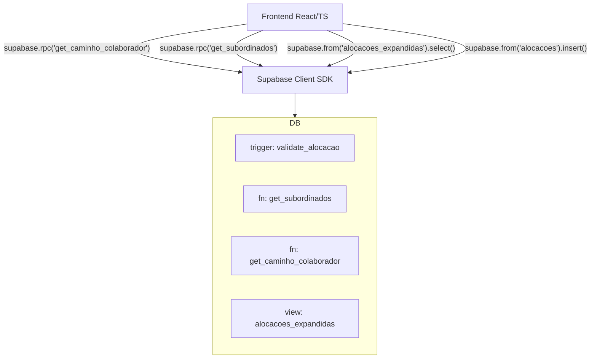
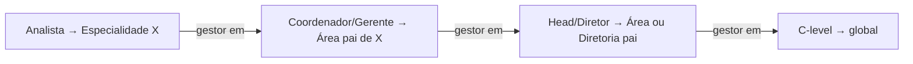

# Design Document — Regras de Negócio de Hierarquia

## Overview

Esta feature formaliza as regras de negócio de hierarquia organizacional do Alocatin. O sistema já possui a estrutura de dados base (tabelas `diretorias`, `areas`, `especialidades`, `colaboradores`, `alocacoes`) e um trigger básico de validação. O objetivo é evoluir o backend Supabase com:

- **Schema revisado**: `area.diretoria_id NOT NULL` (breaking change controlada), garantindo árvore estrita.
- **Trigger `validate_alocacao` completo**: regras de senioridade revisadas — em especial, `Staf I`/`Staf II` aceitam `area` ou `diretoria`, não `especialidade`.
- **Função `get_subordinados` revisada**: cadeia de comando correta por nível de senioridade.
- **Nova função `get_caminho_colaborador`**: retorna caminho hierárquico completo + gestor imediato.
- **View `alocacoes_expandidas` revisada**: JOINs transitivos corretos para todos os scopes.
- **Tipos TypeScript novos**: `ColaboradorComAlocacoes`, `AlocacaoExpandida`, `CaminhoHierarquico`.
- **Serviço `alocacaoService`**: interface de acesso às funções RPC do Supabase.

A hierarquia de nós é: **Empresa (implícita) → Diretoria (L1) → Área (L2) → Especialidade (L3)**.

## Architecture

O sistema segue a arquitetura existente: **React + TypeScript no frontend**, **Supabase (PostgreSQL) no backend**, sem camada de API intermediária. O frontend chama o Supabase diretamente via SDK client-side.



### Decisões de Design

1. **`area.diretoria_id NOT NULL`**: A migração altera a coluna de nullable para NOT NULL. Áreas sem diretoria são inválidas pelo modelo de negócio. A migração deve verificar e corrigir dados existentes antes de aplicar a constraint.
2. **Staf I/II como gestores de área/diretoria**: Diferente dos Analistas (ICs puros), Staf aceita `scope IN ('area', 'diretoria')`. Isso reflete que Staff são especialistas transversais, não alocados a uma especialidade específica.
3. **`get_caminho_colaborador` como função RPC**: Retorna dados desnormalizados prontos para o frontend, evitando múltiplas queries e lógica de join no cliente.
4. **`ColaboradorComAlocacoes` no TypeScript**: Tipo composto que agrega o colaborador base com suas alocações expandidas e caminho hierárquico, facilitando serialização/deserialização consistente.

## Components and Interfaces

### 1. Migração SQL (`supabase/migrations/YYYYMMDD_regras_negocio_hierarquia.sql`)

Responsável por:
- Alterar `areas.diretoria_id` para `NOT NULL`
- Recriar `validate_alocacao` com regras completas
- Recriar `get_subordinados` com lógica corrigida
- Criar `get_caminho_colaborador`
- Recriar `alocacoes_expandidas`

### 2. Tipos TypeScript (`src/types/alocacao.ts`)

```typescript
export interface AlocacaoExpandida {
  alocacao_id: string;
  colaborador_id: string;
  nome_completo: string;
  senioridade: Senioridade;
  scope: 'especialidade' | 'area' | 'diretoria';
  especialidade_id: string | null;
  especialidade_nome: string | null;
  area_id: string | null;
  area_nome: string | null;
  diretoria_id: string | null;
  diretoria_nome: string | null;
}

export interface CaminhoHierarquico {
  colaborador_id: string;
  nome_completo: string;
  senioridade: Senioridade;
  caminho: string[];           // ex: ["Empresa", "Diretoria X", "Área Y", "Especialidade Z"]
  gestor_id: string | null;
  gestor_nome: string | null;
  gestor_senioridade: Senioridade | null;
}

export interface ColaboradorComAlocacoes extends Colaborador {
  alocacoes: AlocacaoExpandida[];
  caminho_hierarquico: string[];
  gestor_imediato: {
    id: string;
    nome: string;
    senioridade: Senioridade;
  } | null;
}
```

### 3. Serviço TypeScript (`src/services/alocacaoService.ts`)

```typescript
export const alocacaoService = {
  // Busca alocações expandidas de um colaborador
  async getByColaborador(colaboradorId: string): Promise<AlocacaoExpandida[]>

  // Chama RPC get_caminho_colaborador
  async getCaminho(colaboradorId: string): Promise<CaminhoHierarquico | null>

  // Chama RPC get_subordinados
  async getSubordinados(gestorId: string): Promise<SubordinadoRow[]>

  // Insere uma alocação (trigger valida no banco)
  async alocar(input: AlocacaoInput): Promise<AlocacaoExpandida>

  // Remove uma alocação
  async desalocar(alocacaoId: string): Promise<void>

  // Monta ColaboradorComAlocacoes a partir de um Colaborador
  async getColaboradorComAlocacoes(colaboradorId: string): Promise<ColaboradorComAlocacoes | null>
}
```

## Data Models

### Schema SQL Revisado

#### Alteração em `areas` (breaking change)

```sql
-- Antes: diretoria_id UUID REFERENCES diretorias(id) ON DELETE SET NULL
-- Depois:
ALTER TABLE public.areas
  ALTER COLUMN diretoria_id SET NOT NULL;
-- Pré-condição: nenhuma área com diretoria_id IS NULL pode existir
```

#### Regras de Senioridade × Scope (tabela de referência)

| Senioridade         | Scopes permitidos          | Cardinalidade |
|---------------------|----------------------------|---------------|
| C-level             | nenhum (escopo global)     | 0 alocações   |
| Diretor(a)          | `area`, `diretoria`        | 1..N          |
| Head                | `area`                     | 1..N          |
| Gerente             | `area`                     | 1..N          |
| Coordenador(a)      | `area`                     | 1..N          |
| Staf I              | `area`, `diretoria`        | 1..N          |
| Staf II             | `area`, `diretoria`        | 1..N          |
| Analista senior     | `especialidade`            | exatamente 1  |
| Analista pleno      | `especialidade`            | exatamente 1  |
| Analista junior     | `especialidade`            | exatamente 1  |

> **Nota**: Staf I/II são especialistas transversais — aceitam `area` ou `diretoria`, mas **não** `especialidade`. Esta é a principal diferença em relação ao trigger atual.

#### Função `get_caminho_colaborador` — assinatura

```sql
CREATE OR REPLACE FUNCTION public.get_caminho_colaborador(p_colaborador_id UUID)
RETURNS TABLE (
  colaborador_id    UUID,
  nome_completo     TEXT,
  senioridade       public.senioridade_enum,
  caminho           TEXT[],
  gestor_id         UUID,
  gestor_nome       TEXT,
  gestor_senioridade public.senioridade_enum
) LANGUAGE plpgsql STABLE;
```

#### Lógica de Gestor Imediato

O gestor imediato é o colaborador de senioridade imediatamente superior alocado no mesmo nó ou no nó pai mais próximo:



#### Cadeia de Reporte Permitida

```
Analista junior/pleno/senior → Coordenador(a) | Gerente
Coordenador(a)               → Head | Gerente
Gerente                      → Head | Diretor(a)
Head                         → Diretor(a) | C-level
Staf I / Staf II             → Head | Gerente | Diretor(a)
Diretor(a)                   → C-level
C-level                      → (nenhum)
```

## Correctness Properties

*A property is a characteristic or behavior that should hold true across all valid executions of a system — essentially, a formal statement about what the system should do. Properties serve as the bridge between human-readable specifications and machine-verifiable correctness guarantees.*

---

### Property 1: Área sempre tem Diretoria

*For any* área inserida no banco, o campo `diretoria_id` deve ser não-nulo e referenciar uma diretoria existente.

**Validates: Requirements 1.2**

---

### Property 2: Caminho transitivo de Especialidade

*For any* especialidade, consultando a view `alocacoes_expandidas` ou a função `get_caminho_colaborador`, o `area_id` e o `diretoria_id` retornados devem corresponder exatamente à área pai da especialidade e à diretoria pai dessa área.

**Validates: Requirements 1.3**

---

### Property 3: C-level não pode ter alocações

*For any* colaborador com senioridade `C-level`, qualquer tentativa de inserir uma alocação com qualquer scope deve ser rejeitada pelo trigger `validate_alocacao`.

**Validates: Requirements 2.1**

---

### Property 4: Scope válido por grupo de senioridade

*For any* colaborador e qualquer tentativa de inserção de alocação:
- Se senioridade é `Diretor(a)`: apenas `scope IN ('area', 'diretoria')` é aceito; `scope = 'especialidade'` é rejeitado.
- Se senioridade é `Head`, `Gerente` ou `Coordenador(a)`: apenas `scope = 'area'` é aceito; qualquer outro scope é rejeitado.
- Se senioridade é `Analista junior`, `Analista pleno` ou `Analista senior`: apenas `scope = 'especialidade'` é aceito; qualquer outro scope é rejeitado.
- Se senioridade é `Staf I` ou `Staf II`: apenas `scope IN ('area', 'diretoria')` é aceito; `scope = 'especialidade'` é rejeitado.

**Validates: Requirements 2.2, 2.3, 2.4, 2.5, 2.6, 2.7, 2.8, 2.9, 2.10**

---

### Property 5: IC Analista tem exatamente 1 alocação

*For any* colaborador com senioridade `Analista junior`, `Analista pleno` ou `Analista senior` que já possui uma alocação, qualquer tentativa de inserir uma segunda alocação deve ser rejeitada pelo trigger.

**Validates: Requirements 2.11**

---

### Property 6: Inferência de caminho para IC via view

*For any* colaborador IC (Analista) com alocação de especialidade, a view `alocacoes_expandidas` deve retornar `area_nome` e `diretoria_nome` não-nulos, inferidos transitivamente a partir da especialidade alocada, sem que esses campos tenham sido inseridos diretamente na tabela `alocacoes`.

**Validates: Requirements 2.12, 5.2**

---

### Property 7: Subordinados de C-level são todos os colaboradores

*For any* organização com N colaboradores (N > 1), chamar `get_subordinados` com o id de um colaborador C-level deve retornar exatamente N-1 colaboradores (todos exceto o próprio C-level).

**Validates: Requirements 3.2**

---

### Property 8: Subordinados corretos por nível de gestão

*For any* gestor (Diretor, Head, Gerente ou Coordenador) com alocações, os colaboradores retornados por `get_subordinados` devem ser exatamente o conjunto de colaboradores alocados nos nós hierárquicos sob gestão desse gestor — nem mais, nem menos.

**Validates: Requirements 3.3, 3.4**

---

### Property 9: IC não tem subordinados

*For any* colaborador com senioridade `Analista junior`, `Analista pleno`, `Analista senior`, `Staf I` ou `Staf II`, chamar `get_subordinados` deve retornar um conjunto vazio.

**Validates: Requirements 3.5**

---

### Property 10: Estrutura do caminho hierárquico por senioridade

*For any* colaborador, o resultado de `get_caminho_colaborador` deve satisfazer:
- O primeiro elemento do array `caminho` é sempre `"Empresa"`.
- Para Analistas: `caminho` tem exatamente 4 elementos `["Empresa", diretoria, area, especialidade]`.
- Para Head/Gerente/Coordenador: `caminho` tem exatamente 3 elementos `["Empresa", diretoria, area]` por alocação.
- Para Diretor(a) com scope `diretoria`: `caminho` tem 2 elementos; com scope `area`: 3 elementos.
- Para C-level: `caminho` é `["Empresa"]`.
- Os campos `colaborador_id`, `nome_completo`, `senioridade`, `caminho`, `gestor_id`, `gestor_nome`, `gestor_senioridade` estão sempre presentes no resultado.

**Validates: Requirements 4.1, 4.2, 4.3, 4.4, 4.7**

---

### Property 11: Gestor imediato pertence ao nível superior correto

*For any* colaborador não-C-level com gestor identificado, o `gestor_senioridade` retornado por `get_caminho_colaborador` deve pertencer ao conjunto de senioridades permitidas para reportar àquele colaborador, conforme a cadeia de reporte definida no Requirement 3.1.

**Validates: Requirements 4.5, 3.1**

---

### Property 12: View expande corretamente por scope

*For any* alocação na tabela `alocacoes`, a view `alocacoes_expandidas` deve:
- Se `scope = 'especialidade'`: `especialidade_nome`, `area_nome` e `diretoria_nome` são não-nulos.
- Se `scope = 'area'`: `area_nome` e `diretoria_nome` são não-nulos; `especialidade_nome` é NULL.
- Se `scope = 'diretoria'`: `diretoria_nome` é não-nulo; `especialidade_nome` e `area_nome` são NULL.

**Validates: Requirements 5.1, 5.2, 5.3, 5.4**

---

### Property 13: Cascata hierárquica preserva consistência

*For any* nó hierárquico (Diretoria, Área ou Especialidade) com filhos e alocações dependentes, excluir esse nó deve resultar na remoção em cascata de todos os filhos e alocações dependentes, sem deixar registros órfãos.

**Validates: Requirements 6.4, 6.5, 6.6**

---

### Property 14: Round-trip de serialização de ColaboradorComAlocacoes

*For any* objeto `ColaboradorComAlocacoes` válido, serializar para JSON (`JSON.stringify`) e desserializar de volta (`JSON.parse`) deve produzir um objeto com os mesmos valores em todos os campos: `id`, `nomeCompleto`, `senioridade`, `alocacoes`, `caminho_hierarquico` e `gestor_imediato`.

**Validates: Requirements 7.2**

---

### Property 15: Round-trip de caminho hierárquico para IDs

*For any* colaborador com alocações, formatar o `caminho_hierarquico` como array de strings e depois parsear de volta para os IDs dos nós deve recuperar os mesmos `diretoria_id`, `area_id` e `especialidade_id` originais.

**Validates: Requirements 7.3, 7.4**

## Error Handling

### Erros do Trigger `validate_alocacao`

| Condição | Mensagem de erro |
|---|---|
| C-level tenta ter alocação | `'C-level tem escopo global e não deve ter alocações específicas.'` |
| Diretor(a) com scope 'especialidade' | `'Diretor(a) não pode ser alocado diretamente em uma Especialidade (L3).'` |
| Head/Gerente/Coordenador com scope != 'area' | `'<senioridade> só pode ser alocado em Áreas (L2). Scope inválido: <scope>.'` |
| Analista com scope != 'especialidade' | `'Analistas só podem ser alocados em Especialidade (L3). Scope inválido: <scope>.'` |
| Staf I/II com scope 'especialidade' | `'Staf I/II não podem ser alocados em Especialidade. Scope inválido: especialidade.'` |
| IC com segunda alocação | `'Colaboradores IC só podem ter exatamente 1 alocação.'` |

### Erros das Funções RPC

| Função | Condição | Comportamento |
|---|---|---|
| `get_subordinados` | id não existe | `RAISE EXCEPTION 'Colaborador <id> não encontrado.'` |
| `get_caminho_colaborador` | id não existe | Retorna conjunto vazio (sem exceção) |

### Erros no Frontend (alocacaoService)

- Erros do Supabase são propagados como `Error` com a mensagem original do banco.
- O serviço não silencia erros de validação — eles devem ser exibidos ao usuário via toast/alert.
- Erros de constraint (UNIQUE, CHECK) são capturados e re-lançados com mensagem amigável.

## Testing Strategy

### Abordagem Dual

A estratégia combina **testes unitários** (exemplos específicos e casos de borda) com **testes baseados em propriedades** (cobertura universal via geração aleatória de inputs).

### Testes Unitários (Vitest)

Focados em:
- Exemplos concretos de aceitação/rejeição do trigger por senioridade
- Casos de borda: id inexistente, alocação duplicada, scope nulo
- Integração entre `alocacaoService` e Supabase (com mock do cliente)
- Serialização/deserialização de `ColaboradorComAlocacoes` com dados fixos

Arquivo: `src/test/regras-negocio-hierarquia.test.ts`

### Testes Baseados em Propriedades (fast-check)

Biblioteca: **fast-check** (já compatível com Vitest, sem dependências adicionais além de `npm install fast-check`).

Configuração: mínimo **100 iterações** por propriedade (`numRuns: 100`).

Cada teste deve incluir um comentário de rastreabilidade:
```
// Feature: regras-negocio-hierarquia, Property <N>: <texto da propriedade>
```

#### Mapeamento Propriedade → Teste

| Propriedade | Tipo de teste | Padrão PBT |
|---|---|---|
| P1: Área sempre tem Diretoria | property | Invariante de schema |
| P2: Caminho transitivo de Especialidade | property | Round-trip |
| P3: C-level sem alocações | property | Error condition |
| P4: Scope válido por grupo | property | Error condition + Invariante |
| P5: IC tem exatamente 1 alocação | property | Invariante de cardinalidade |
| P6: Inferência de caminho para IC | property | Round-trip / Metamórfico |
| P7: Subordinados de C-level | property | Metamórfico |
| P8: Subordinados corretos por nível | property | Model-based |
| P9: IC sem subordinados | property | Invariante |
| P10: Estrutura do caminho por senioridade | property | Invariante |
| P11: Gestor pertence ao nível correto | property | Invariante |
| P12: View expande por scope | property | Invariante |
| P13: Cascata hierárquica | property | Round-trip / Invariante |
| P14: Round-trip ColaboradorComAlocacoes | property | Round-trip |
| P15: Round-trip caminho → IDs | property | Round-trip |

#### Geradores fast-check para o domínio

```typescript
// Gerador de senioridade aleatória
const arbSenioridade = fc.constantFrom(...SENIORIDADES);

// Gerador de scope aleatório
const arbScope = fc.constantFrom('especialidade', 'area', 'diretoria');

// Gerador de colaborador com senioridade específica
const arbColaboradorIC = fc.record({
  id: fc.uuid(),
  nomeCompleto: fc.string({ minLength: 3 }),
  senioridade: fc.constantFrom('Analista junior', 'Analista pleno', 'Analista senior'),
  status: fc.constant('Ativo'),
  dataAdmissao: fc.string(),
  area_ids: fc.constant([]),
  squad_ids: fc.constant([]),
});

// Gerador de ColaboradorComAlocacoes para round-trip
const arbColaboradorComAlocacoes = fc.record({
  // ... campos do Colaborador base
  alocacoes: fc.array(arbAlocacaoExpandida),
  caminho_hierarquico: fc.array(fc.string({ minLength: 1 }), { minLength: 1 }),
  gestor_imediato: fc.option(fc.record({
    id: fc.uuid(),
    nome: fc.string({ minLength: 1 }),
    senioridade: arbSenioridade,
  })),
});
```

### Cobertura Esperada

- Todas as 15 propriedades de corretude cobertas por testes PBT
- Casos de borda (ids inexistentes, constraints violadas) cobertos por testes unitários
- Funções SQL testadas via Supabase client com banco de teste isolado ou mocks
