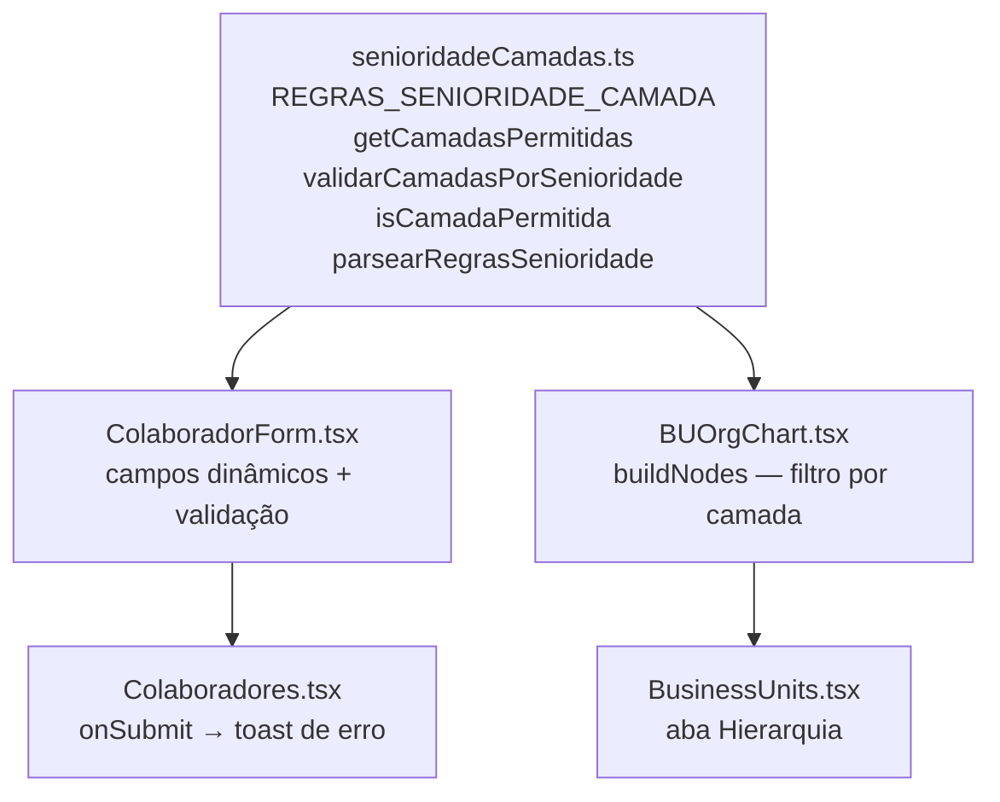

# Design Document — Regras de Senioridade por Camada

## Overview

Esta feature introduz um módulo central de validação (`src/utils/senioridadeCamadas.ts`) que codifica as regras de negócio que determinam em quais camadas organizacionais (BU, Torre, Squad) cada nível de senioridade pode ser alocado. O módulo é consumido por dois pontos do sistema:

1. **ColaboradorForm** — exibe campos dinâmicos e valida a submissão.
2. **BUOrgChart / buildNodes** — filtra quais colaboradores aparecem em cada nó do organograma.

A abordagem é puramente frontend: nenhuma migração de banco é necessária. As regras vivem em TypeScript puro, sem dependências de estado externo, o que facilita testes unitários e de propriedade.

---

## Architecture



O fluxo de dados é unidirecional: o módulo central exporta funções puras; os componentes as importam e reagem ao estado local do React.

---

## Components and Interfaces

### `src/utils/senioridadeCamadas.ts` (novo)

```ts
export type Camada = "BU" | "Torre" | "Squad";

export const REGRAS_SENIORIDADE_CAMADA: Record<Senioridade, Camada[]> = {
  "C-level":        ["BU"],
  "Diretor(a)":     ["BU", "Torre"],
  "Head":           ["Torre"],
  "Gerente":        ["Torre"],
  "Coordenador(a)": ["Torre", "Squad"],
  "Staf I":         ["Torre", "Squad"],
  "Staf II":        ["Torre", "Squad"],
  "Analista senior":["Torre", "Squad"],
  "Analista pleno": ["Squad"],
  "Analista junior":["Squad"],
};

/** Retorna as camadas permitidas para uma senioridade. */
export function getCamadasPermitidas(senioridade: Senioridade): Camada[];

/** Verifica se uma camada específica é permitida para a senioridade. */
export function isCamadaPermitida(senioridade: Senioridade, camada: Camada): boolean;

/**
 * Valida se o conjunto de camadas fornecido é compatível com a senioridade.
 * Retorna { valido: true } ou { valido: false, mensagem: string }.
 */
export function validarCamadasPorSenioridade(
  senioridade: Senioridade,
  camadas: Camada[]
): { valido: boolean; mensagem?: string };

/**
 * Deserializa uma string JSON para Record<Senioridade, Camada[]>.
 * Lança erro descritivo para senioridades ou camadas desconhecidas.
 */
export function parsearRegrasSenioridade(
  json: string
): Record<Senioridade, Camada[]>;
```

### `ColaboradorForm.tsx` (modificado)

- Substituir a lógica atual de `showSquad / showArea / showEspecialidade` baseada em `SENIORIDADE_GRUPOS` por derivações a partir de `getCamadasPermitidas`.
- Adicionar campo de seleção de **BU** (novo) para senioridades `C-level` e `Diretor(a)`.
- Adicionar campo de seleção de **Torre** (novo) para senioridades `Diretor(a)`, `Head`, `Gerente`, `Coordenador(a)`, `Staf I`, `Staf II`, `Analista senior`.
- Manter campo de **Squad** para senioridades que incluem `Squad` nas camadas permitidas.
- Ao mudar senioridade, limpar valores dos campos que se tornaram inválidos.
- Ao abrir edição com dados inconsistentes, exibir aviso inline.

### `BUOrgChart.tsx` — `buildNodes` (modificado)

- Nos nós `bu`: filtrar `colaboradores` por `isCamadaPermitida(c.senioridade, "BU")` e por `bu_id` do colaborador.
- Nos nós `torre`: filtrar por `isCamadaPermitida(c.senioridade, "Torre")` e por `torre_id` do colaborador.
- Nos nós `squad`: filtrar por `isCamadaPermitida(c.senioridade, "Squad")` e por `squad_ids` do colaborador.
- Colaboradores com dados inconsistentes são omitidos do nó incompatível (Req 3.6).

---

## Data Models

Nenhuma alteração de schema de banco de dados é necessária. O modelo de dados existente já suporta a feature:

| Campo no colaborador | Camada mapeada | Observação |
|---|---|---|
| `bu_id` (a adicionar no form) | BU | Atualmente não existe no schema `colaboradores`; a alocação em BU é inferida via `torres.bu_id` para C-level/Diretor |
| `torre_ids` (a adicionar no form) | Torre | Atualmente a ligação Torre↔Colaborador é via campos `responsavel_negocio`, `head_tecnologia`, etc. em `torres` |
| `squad_ids` | Squad | Já existe em `colaboradores` |

> **Decisão de design**: Para não exigir migração de banco nesta fase, a alocação em BU e Torre continuará sendo inferida pelos campos existentes em `torres` (responsavel_negocio, head_tecnologia, etc.) e pela relação `torres.bu_id`. O `ColaboradorForm` exibirá os campos de BU/Torre como seletores que atualizam esses campos relacionais nas torres, não como colunas diretas em `colaboradores`. O `ValidadorSenioridade` operará sobre o conjunto de camadas derivado dessas relações.

### Tipo `Camada`

```ts
// src/utils/senioridadeCamadas.ts
export type Camada = "BU" | "Torre" | "Squad";
```

### Derivação de camadas ativas de um colaborador

Para validação, as camadas ativas de um colaborador são derivadas assim:

```ts
function camadasAtivas(colaborador: Colaborador, torres: Torre[], businessUnits: BusinessUnit[]): Camada[] {
  const camadas: Camada[] = [];
  // Squad: direto
  if (colaborador.squad_ids.length > 0) camadas.push("Squad");
  // Torre: é responsável em alguma torre
  const emTorre = torres.some(t =>
    [t.responsavel_negocio, t.head_tecnologia, t.head_produto, t.gerente_produto, t.gerente_design]
      .includes(colaborador.id)
  );
  if (emTorre) camadas.push("Torre");
  // BU: está em torre que pertence a uma BU (C-level/Diretor inferido)
  const buDaTorre = torres.find(t =>
    [t.responsavel_negocio, t.head_tecnologia, t.head_produto, t.gerente_produto, t.gerente_design]
      .includes(colaborador.id)
  );
  if (buDaTorre?.bu_id) camadas.push("BU");
  return [...new Set(camadas)];
}
```

---

## Correctness Properties

*A property is a characteristic or behavior that should hold true across all valid executions of a system — essentially, a formal statement about what the system should do. Properties serve as the bridge between human-readable specifications and machine-verifiable correctness guarantees.*


### Property 1: Validação por senioridade é consistente com o mapa de regras

*Para qualquer* senioridade `s` e qualquer conjunto não-vazio de camadas `C`, `validarCamadasPorSenioridade(s, C)` retorna `{ valido: true }` se e somente se `C` é subconjunto de `REGRAS_SENIORIDADE_CAMADA[s]`; caso contrário retorna `{ valido: false, mensagem: string }` com mensagem não-vazia.

**Validates: Requirements 1.1, 1.2, 1.3, 1.4, 1.5, 1.6, 1.7, 1.8, 1.9, 1.10, 1.11**

### Property 2: Pureza e idempotência da função de validação

*Para qualquer* senioridade `s` e qualquer conjunto de camadas `C`, chamar `validarCamadasPorSenioridade(s, C)` múltiplas vezes com os mesmos argumentos deve sempre retornar o mesmo resultado (sem efeitos colaterais observáveis).

**Validates: Requirements 1.12, 4.2**

### Property 3: Completude do mapa REGRAS_SENIORIDADE_CAMADA

*Para qualquer* valor do tipo `Senioridade`, `REGRAS_SENIORIDADE_CAMADA` deve conter uma entrada com array de camadas não-vazio, garantindo que nenhuma senioridade fique sem regra definida.

**Validates: Requirements 4.3, 4.5**

### Property 4: Campos dinâmicos do formulário refletem exatamente as camadas permitidas

*Para qualquer* senioridade selecionada no `ColaboradorForm`, o conjunto de campos de camada visíveis deve ser exatamente igual ao conjunto retornado por `getCamadasPermitidas(senioridade)`, e os campos de camadas não-permitidas devem ter seus valores limpos.

**Validates: Requirements 2.1, 2.7**

### Property 5: Filtro do organograma respeita regras de senioridade por camada

*Para qualquer* conjunto de colaboradores e qualquer nó de camada `k` (BU, Torre ou Squad) no organograma, todos os colaboradores exibidos naquele nó devem satisfazer `isCamadaPermitida(colaborador.senioridade, k) === true`; colaboradores com senioridade incompatível com a camada do nó não devem aparecer nele.

**Validates: Requirements 3.1, 3.2, 3.3, 3.4, 3.6**

### Property 6: Round-trip de serialização das regras

*Para qualquer* objeto `Record<Senioridade, Camada[]>` equivalente a `REGRAS_SENIORIDADE_CAMADA`, serializar com `JSON.stringify` e desserializar com `parsearRegrasSenioridade` deve produzir um objeto com os mesmos pares chave-valor (mesmas senioridades, mesmas camadas na mesma ordem).

**Validates: Requirements 5.1, 5.2, 5.3**

### Property 7: Erro descritivo no parse para entradas inválidas

*Para qualquer* string JSON que contenha uma senioridade ou camada não reconhecida pelo sistema, `parsearRegrasSenioridade` deve lançar (ou retornar) um erro com mensagem que identifica o valor inválido específico.

**Validates: Requirements 5.4, 5.5**

---

## Error Handling

| Situação | Comportamento esperado |
|---|---|
| `validarCamadasPorSenioridade` recebe camadas vazias `[]` | Retorna `{ valido: false, mensagem: "Selecione ao menos uma camada." }` |
| `validarCamadasPorSenioridade` recebe senioridade desconhecida | Lança `TypeError` com mensagem descritiva |
| `parsearRegrasSenioridade` recebe JSON malformado | Lança `SyntaxError` nativo do `JSON.parse` |
| `parsearRegrasSenioridade` recebe senioridade desconhecida | Lança `Error` com `"Senioridade inválida: <valor>"` |
| `parsearRegrasSenioridade` recebe camada desconhecida | Lança `Error` com `"Camada inválida: <valor>"` |
| `ColaboradorForm` abre com dados inconsistentes | Exibe `<Alert>` amarelo com lista das inconsistências; não bloqueia edição |
| Submissão do formulário com camadas inválidas | `validarCamadasPorSenioridade` retorna erro; toast de erro é exibido; submissão é cancelada |
| Colaborador sem camadas ativas no organograma | Não aparece em nenhum nó; sem erro de runtime |

---

## Testing Strategy

### Abordagem dual

A estratégia combina **testes unitários** (exemplos concretos e edge cases) com **testes de propriedade** (cobertura ampla via geração aleatória).

- Testes unitários: exemplos específicos, casos de borda, integração entre componentes.
- Testes de propriedade: verificam as 7 propriedades de corretude acima para centenas de inputs gerados.

### Biblioteca de property-based testing

**fast-check** (já disponível no ecossistema TypeScript/Vitest). Configuração mínima de 100 iterações por propriedade.

```ts
import fc from "fast-check";
// Exemplo de arbitrário para senioridade:
const arbSenioridade = fc.constantFrom(...SENIORIDADES);
// Exemplo de arbitrário para camadas:
const arbCamadas = fc.subarray(["BU", "Torre", "Squad"] as Camada[], { minLength: 1 });
```

### Testes unitários (arquivo: `src/test/regras-senioridade-camada.test.ts`)

- Smoke test: módulo exporta todas as funções esperadas (Req 4.4).
- Exemplo: C-level com `["BU"]` → válido; C-level com `["Torre"]` → inválido.
- Exemplo: Diretor(a) com `["BU", "Torre"]` → válido; Diretor(a) com `["Squad"]` → inválido.
- Exemplo: `parsearRegrasSenioridade` com JSON válido retorna objeto correto.
- Exemplo: `parsearRegrasSenioridade` com senioridade inválida lança erro descritivo.
- Edge case: colaborador com dados inconsistentes não aparece em nó incompatível no organograma.
- Edge case: Diretor(a) alocado em BU e Torre aparece em ambos os nós (Req 3.5).

### Testes de propriedade (mesmo arquivo, seção `describe("properties")`)

Cada teste de propriedade deve ser anotado com o tag de rastreabilidade:

```
// Feature: regras-senioridade-camada, Property 1: Validação por senioridade é consistente com o mapa de regras
```

| Propriedade | Arbitrários | Asserção |
|---|---|---|
| P1 — Validação consistente | `arbSenioridade × arbCamadas` | `valido === isSubset(C, REGRAS[s])` |
| P2 — Pureza/idempotência | `arbSenioridade × arbCamadas` | `result1 deepEqual result2` |
| P3 — Completude do mapa | `arbSenioridade` | `REGRAS[s].length > 0` |
| P4 — Campos do formulário | `arbSenioridade` | `visibleFields === getCamadasPermitidas(s)` |
| P5 — Filtro do organograma | `arbColaboradores × arbCamada` | `todos os exibidos têm isCamadaPermitida === true` |
| P6 — Round-trip serialização | constante `REGRAS_SENIORIDADE_CAMADA` | `parse(stringify(regras)) deepEqual regras` |
| P7 — Erro de parse inválido | `fc.string()` com valores inválidos injetados | `lança erro com valor inválido na mensagem` |

Mínimo de 100 iterações por propriedade (`{ numRuns: 100 }`).
